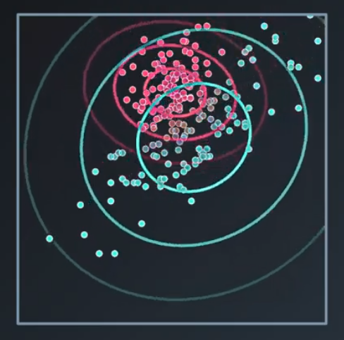
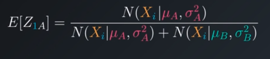
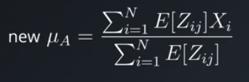
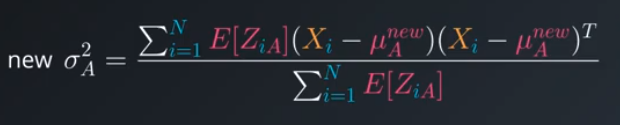
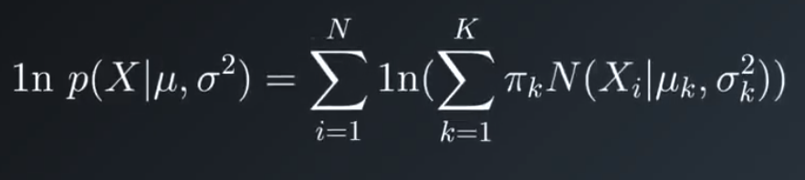
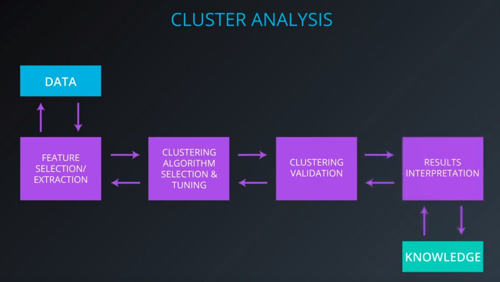
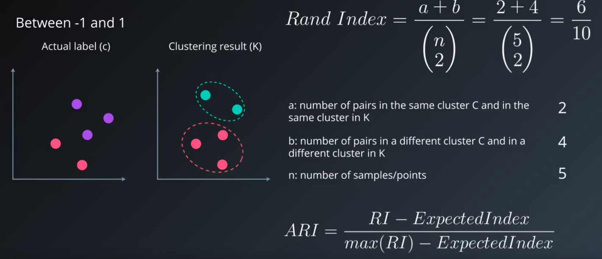
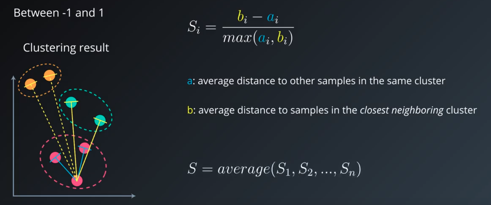

# Gaussian Mixture Models
Assumes that each cluster follows a certain statistical distribution (Gaussian distribution). Gives the probability of a point belonging to each of **k** clusters.

 k=2

## Expectation Maximization Algorithm

1. Initialize K Gaussian distributions: To give a mean and a variance for each one. To set the distributions we use clusters created by K-Means.

2. Soft-Cluster data - "Expectation": Calculate the membership of each to each clusters



3. Re-Estimate the Gaussians - "Maximization": **Pondered**




4. Evaluate Log-Likelihood to check for convergence
    - If not: repeat step 2 until converged


- The higher this number is, the more sure we are taht the mixer model fits the dataset that we have. The purpose here is to maximize this value
- π: The mixing coefficient

> Better results using covariance matrix instead of a variance

## Scikit-learn Implementation

```python
from sklearn import dataset, mixture

X = datasets.load_iris().data[:10]

gmm = mixture.GaussianMixture(n_components=3)

gmm.fit(X)

clustering = gmm.predict(X)
```
### Advantages
- Soft-Clustering (sample membership of multiple clusters)
- Cluster shape flexibility

### Disavantages
- Sensitive to initialization values
- Possible to converge to a local optimum
- Slow convergence rate

## Cluster Analysis

- Feature Selection/Extraction: PCA (principle components analysis)
- Clustering Algorithm Selection & Tuning: We also have to choose a proximity measure (Euclidean Measure/Cosine Similarity/Pearson Correlation)
- Clustering Validation: How well a clustering turn out to be. Scoring methods to evaluate the quality of the clustering structure based on certain criteria (Indices).
- Results Interpretation: Insights (Domain expertise)



### Cluster Validation
The procedure of evaluating the results of a clustering objectively and quantitatively

Categories of cluster validation indices:
- External indices: We use if our data was originally labeled
- Internal indices: Measure the fit between the data and the structure using only the data
- Relative indices: indicate which of two clustering structures is better in some sense (all internal indices can be a relative indices)


- Compactness: a measure of how close the elements of a cluster are to each other
- Separability: is how far or distinct clusters are from each other

#### External indices

| Index | Range | Available in sklearn |
|:---:|:---:|:---:|
| Adjusted Rand Score | [-1,1] | ✔ |
| Fawlks and Mallows | [0,1] | ✔ |
| NMI measure | [0,1] | ✔ |
| Jaccard | [0,1] | ✔ |
| F-measure | [0,1] | ✔ |
| Purity | [0,1] | ✘ |

**Adjusted Rand Score**


#### Internal indices

| Index | Range | Available in sklearn |
|:---:|:---:|:---:|
| Silhouette index | [-1,1] | ✔ |
| Calinski-Harabasz |  | ✔ |
| BIC |  | ✘ |
| Dunn Index |  | ✘ |

**Silhouette index**

- For DBSCAN, we should never use silhouette coefficient (DBCV)

### Feature Scaling

X' = (X - Xmin) / (Xmax - Xmin)

- 0 <= X' <= 1
- Outliers can kind of mess up your rescaling
